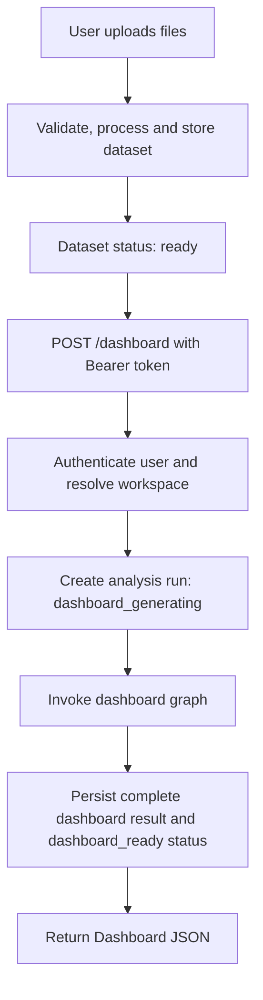
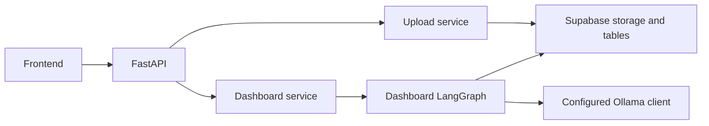
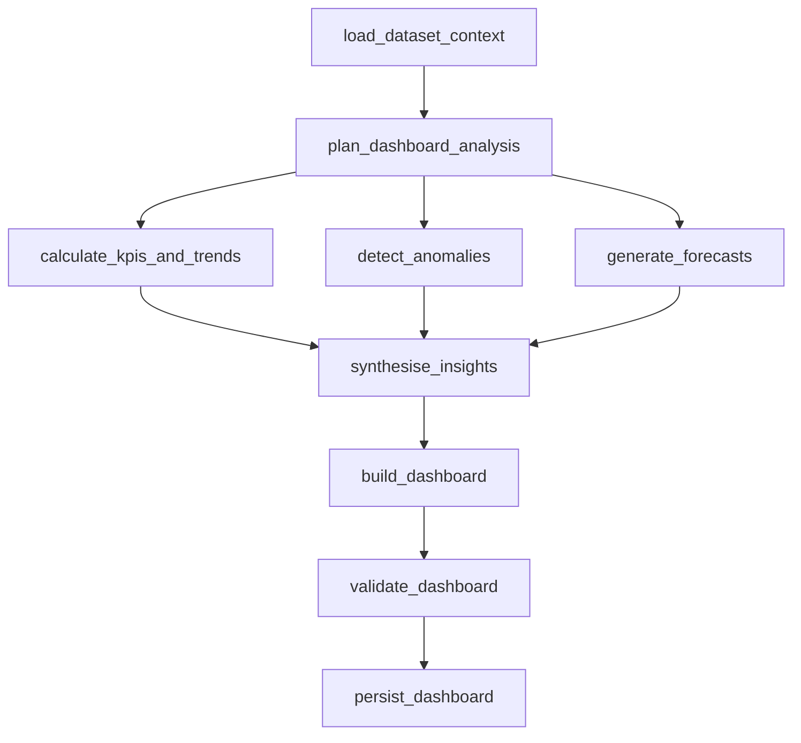

# MMP Backend Architecture

## 1. Current implementation

This repository is the backend for an analytics platform. It currently implements a deterministic upload pipeline and a synchronous dashboard-generation endpoint. The dashboard workflow is a LangGraph graph that returns a complete dashboard response in the same HTTP request.

Chat, dashboard-status reads, and deterministic dashboard calculations are not implemented yet. The dashboard result is persisted for authenticated retrieval, but it does not yet provide the verified analytical evidence required for chat.

## 2. Runtime flow

The implemented flow is:

```text
Upload dataset
→ Process and persist the dataset
→ Dataset status becomes ready
→ POST /dashboard with a Bearer token
→ Resolve the authenticated user's workspace
→ Select its newest ready dataset
→ Create an analysis run (dashboard_generating)
→ Invoke the dashboard LangGraph synchronously
→ Persist the complete dashboard result and mark the run dashboard_ready
→ Return the complete Dashboard response (HTTP 200)
```



`POST /dashboard` has no request body. It is synchronous: the caller waits for graph execution, persistence, and response construction. `GET /dashboard` retrieves the authenticated user's latest complete, ready dashboard. The API does not currently provide a status-polling endpoint.

## 3. Main components



- The upload service validates, normalises, profiles, converts, and stores uploaded tabular data.
- The dashboard service selects a ready dataset, creates an analysis run, invokes the graph, and maps graph state to the public response schema.
- The dashboard graph carries run-scoped state only.
- Supabase persists workspaces, datasets, fields, analysis runs, and the generated chart layout.
- The configured Ollama client gives the supervisor, KPI, anomaly, forecast, insight, layout, and chat agents separate model settings in `agent_models.toml`.

## 4. Upload pipeline

The upload route requires a Bearer token and resolves the workspace from the verified user. The ingestion service validates uploaded CSV or Parquet files, normalises the data, writes a processed Parquet file, profiles fields, and stores dataset and field metadata.

After successful processing, the dataset status is `ready`. Dashboard generation only selects datasets with that status.

## 5. Dashboard API request and response

### Request

```http
POST /dashboard
Authorization: Bearer <access-token>
```

The `workspace` dependency first validates the Bearer token with Supabase Auth. It then retrieves the user's workspace, creating one when none exists.

### Service flow

`DashboardService.generate_dashboard(workspace_id)` performs the following work:

1. Select the workspace's most recently uploaded dataset with `status = ready`.
2. Insert an `analysis_runs` record with its dataset and workspace identifiers and status `dashboard_generating`.
3. Invoke the compiled dashboard graph with `analysis_id` and `dataset_id`.
4. Build a `Dashboard` response from the final graph state and return it.

The selected analysis identifier is internal: it is not included in the current response schema.

Each analysis run currently belongs to exactly one dataset because `analysis_runs.dataset_id` is a single foreign key. `load_dataset_context` uses the run and dataset identifiers to verify that relationship, then returns the linked dataset metadata and all ordered field definitions. Correct multi-dataset analysis will require an analysis-to-datasets join table and dataset-qualified field references before the graph state can change to `dataset_ids`.

### Response

The successful response is HTTP 200 and conforms to the immutable `Dashboard` schema:

- `workspace_id` and `generated_at`
- Dataset metadata and summary counts
- KPIs and charts
- Anomaly and forecast sections
- Insights, recommendations, and warnings

`generated_at` is created when the graph persists the dashboard and is returned unchanged by subsequent dashboard reads.

### Current error behaviour

- Missing or invalid Bearer token: HTTP 401.
- Expected `ValueError` from dashboard creation or graph validation: HTTP 422.
- Invalid KPI or anomaly worker output is omitted with a persisted warning, and invalid forecast worker output becomes an explicit unavailable result with a warning.
- Other failures, including supervisor, insight, layout, database, and response-construction failures: unhandled HTTP 500 responses.

If dashboard graph construction or execution fails after the analysis run is created, the service changes the run to `failed` and records `failure_stage = dashboard_generation` with the exception message in `failure_diagnostic` before re-raising the error.

## 6. Dashboard LangGraph

The graph is compiled per service invocation. Its typed `DashboardState` carries only the fields for that one run:

```python
class DashboardState(TypedDict):
    analysis_id: str
    dataset_id: str
    schema: dict
    analysis_plan: dict
    kpis: list
    trends: list
    anomalies: list
    forecasts: list
    insights: list
    recommendations: list
    dashboard: dict
    errors: list[str]
```

The workflow is:



### Node responsibilities

| Node | Current responsibility |
|---|---|
| `load_dataset_context` | Verifies that the analysis belongs to the dataset, then loads dataset metadata and ordered field definitions from Supabase. |
| `plan_dashboard_analysis` | Requests a structured field-selection plan from the configured LLM and rejects unknown fields. |
| `calculate_kpis_and_trends` | Requests structured KPI and trend output from the LLM and validates trend field references. |
| `detect_anomalies` | Requests structured anomaly output from the LLM and validates dataset and field references. |
| `generate_forecasts` | Requests structured forecast output from the LLM and validates forecast targets. |
| `synthesise_insights` | Requests insight and recommendation output from the LLM; evidence IDs must refer to state results. |
| `build_dashboard` | Requests a chart layout from the LLM and validates dataset and field references. |
| `validate_dashboard` | Validates the chart-layout schema, chart IDs, required values, and chart-series rules. |
| `persist_dashboard` | Saves the complete dashboard result and changes the analysis-run status to `dashboard_ready`. |

The KPI/trend, anomaly, and forecast nodes are currently LLM-backed. They do not execute DuckDB queries, inspect the stored Parquet file, or invoke deterministic analytical or forecasting models. Their numeric values and SQL strings are therefore not independently verified by the backend.

## 7. Persistence

The relevant persisted records are:

- `datasets`: uploaded dataset metadata, its `ready`/`failed` status, and processing metadata.
- `dataset_fields`: each dataset's normalised fields, types, roles, and profiles.
- `analysis_runs`: the selected dataset and workspace, status, creation time, and chart layout.

For a successful dashboard run, the implementation persists this effective shape in `analysis_runs`:

```json
{
  "id": "...",
  "dataset_id": "...",
  "workspace_id": "...",
  "status": "dashboard_ready",
  "dashboard": {
    "charts": []
  },
  "failure_stage": null,
  "failure_diagnostic": null,
  "created_at": "..."
}
```

The graph persists the chart layout, KPIs, trends, anomalies, forecasts, insights, recommendations, warnings, and generation timestamp together in `dashboard`. On graph failure, the status, failure stage, and failure diagnostic are persisted instead.

Row-level-security policies exist for workspaces, datasets, dataset fields, and analysis runs. At the API boundary, dashboard generation is scoped to the workspace derived from the authenticated user rather than a workspace identifier supplied by the client.

## 8. Available and unavailable endpoints

| Endpoint | Status | Behaviour |
|---|---|---|
| `POST /upload` | Implemented | Authenticates, processes uploads, and stores ready datasets. |
| `POST /dashboard` | Implemented | Generates a dashboard synchronously for the authenticated user's newest ready dataset. |
| `GET /dashboard` | Implemented | Returns the authenticated user's latest complete `dashboard_ready` result. It returns 404 when no ready result exists or an older chart-only result cannot be reconstructed safely. |
| `POST /chat` | Placeholder | Returns a fixed “Not implemented yet.” response. |

There is no analysis-status endpoint, dashboard-regeneration endpoint, or dataset-replacement endpoint in the current implementation.

## 9. Frontend integration

The frontend should currently:

1. Authenticate the user.
2. Upload a supported dataset and wait for upload success.
3. Call `POST /dashboard` with the Bearer token.
4. Wait for the synchronous response.
5. Render the returned `Dashboard` object directly, or reload it later through authenticated `GET /dashboard`.

It must not currently poll an analysis status endpoint or expect `analysis_id` in the response.

## 10. Verification

Focused coverage currently verifies:

- Bearer-token enforcement and workspace resolution for dashboard generation.
- Dashboard-service request-to-graph input mapping, response-schema construction, and persisted-dashboard reconstruction.
- Failure-status persistence when dashboard graph execution raises.
- Full graph routing and persistence of the chart layout/status.
- Structured LLM output validation at the client and graph-agent boundaries.
- Dashboard layout validation rules.

## 11. Pending architecture work

The following documented capabilities are not part of the current runtime flow:

1. Deterministic KPI, trend, anomaly, and forecast calculations over the processed Parquet data.
2. Validation that chart and KPI SQL has executed successfully against the selected dataset.
3. Authorised analysis-status endpoints.
4. A separate `ChatState` LangGraph workflow that reads persisted dashboard evidence and executes guarded dataset queries.
5. A multi-dataset analysis contract with an analysis-to-datasets join table and dataset-qualified field references.

These changes should be designed together before changing the endpoint contract or enabling chat.
