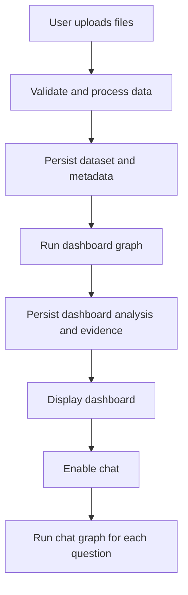
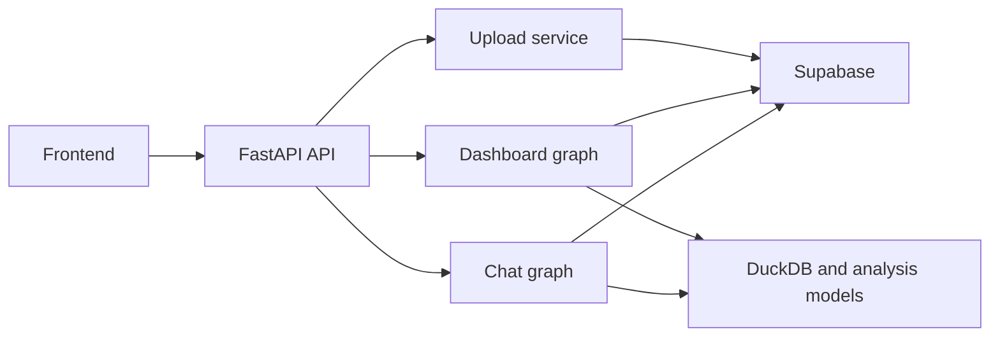
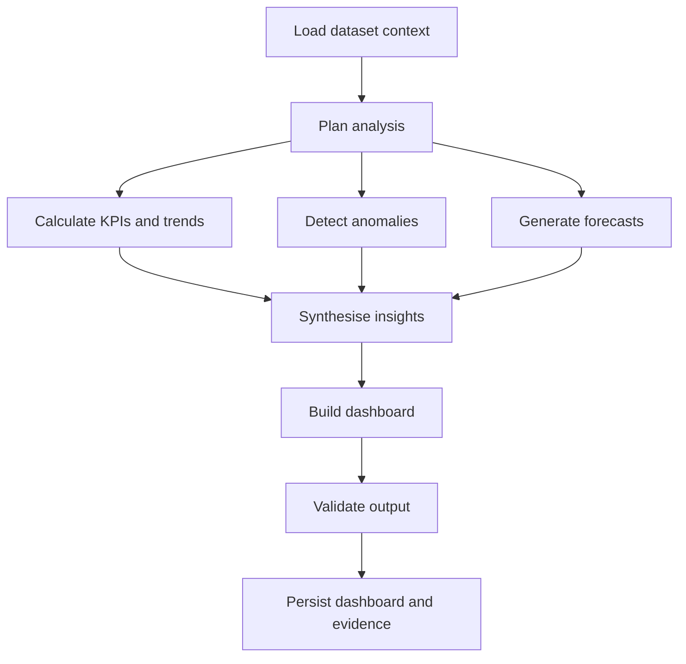
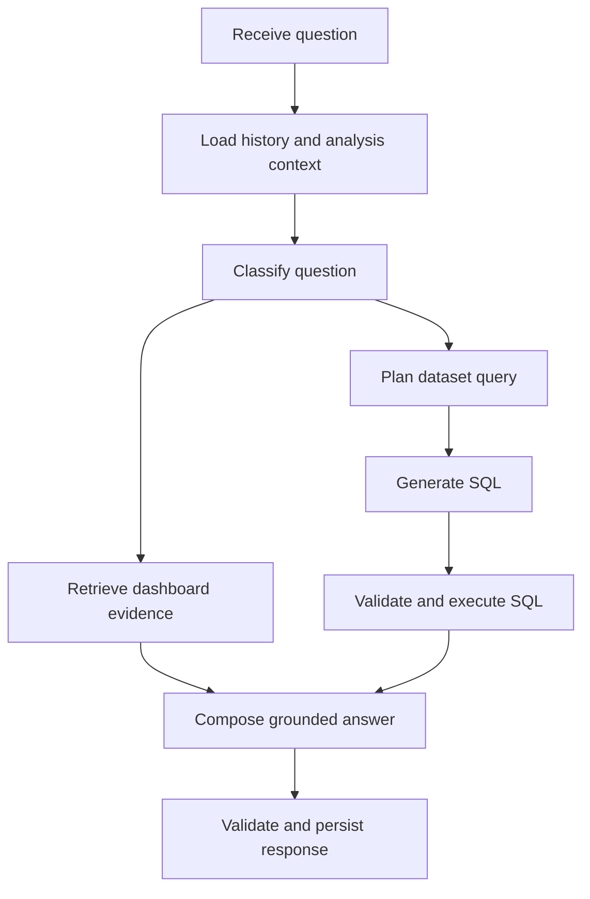

# Multi-Agent Data Analysis Platform

## 1. Project overview

This project is a web-based multi-agent data analysis platform for small and medium-sized businesses. Users upload business datasets and receive an automatically generated analytical dashboard. Once the dashboard is ready, users can ask questions about the dataset and the generated analysis through a grounded conversational interface.

The system combines deterministic data processing with LangGraph-based workflows. Deterministic code handles file processing, calculations, validation, and persistence. Specialised agents interpret verified analytical results, generate insights, construct the dashboard, and answer user questions.

## 2. System flow

The confirmed runtime order is:

```text
Upload → Dashboard generation → Chat
```



Chat becomes available only after the dashboard has been generated successfully. This ensures that chat can retrieve and explain dashboard outputs such as KPIs, trends, anomalies, forecasts, insights, and recommendations.

## 3. Architecture

The backend contains three main parts:

1. A deterministic upload pipeline implemented with FastAPI services.
2. A dashboard workflow implemented as a LangGraph graph.
3. A chat workflow implemented as a separate LangGraph graph.

Supabase provides authentication, relational persistence, and file storage. DuckDB queries processed datasets. Each LangGraph graph has its own typed, run-scoped state. Durable data is persisted in Supabase and shared between workflows through identifiers.



## 4. Upload pipeline

The upload pipeline prepares data for dashboard generation.

```text
Authenticate user
→ Validate uploaded files
→ Read and normalise data
→ Convert data to Parquet
→ Profile columns
→ Create schema metadata
→ Store files and metadata
→ Return the workspace identifier
```

### Responsibilities

- Verify user ownership and access.
- Validate file type, size, structure, and required content.
- Normalise column names and supported data types.
- Preserve the original file and create a processed Parquet version.
- Profile columns and record schema metadata.
- Persist the dataset, file locations, and processing status.
- Resolve the authenticated user's workspace from their verified JWT.
- Remove incomplete records and files when processing fails.

The upload response returns uploaded file summaries and an `uploaded` status. Dataset and workspace identifiers remain internal. The frontend invokes dashboard generation with its Bearer token; the backend verifies the token and resolves the user's workspace.

## 5. Dashboard LangGraph

The dashboard graph performs the initial analysis and produces the structured dashboard shown to the user.



### Nodes

1. `load_dataset_context`
2. `plan_dashboard_analysis`
3. `calculate_kpis_and_trends`
4. `detect_anomalies`
5. `generate_forecasts`
6. `synthesise_insights`
7. `build_dashboard`
8. `validate_dashboard`
9. `persist_dashboard`

### Node responsibilities

| Operation | Implementation |
|---|---|
| Dataset and schema loading | Application service and Supabase |
| Analysis planning | Dashboard graph node calling the planner agent with the LLM client and schema metadata |
| KPI calculation | DuckDB or deterministic code |
| Trend calculation | DuckDB or deterministic code |
| Anomaly detection | Statistical or machine-learning model |
| Forecasting | Forecasting model |
| Insight synthesis | Dashboard graph node calling the insight agent with verified analytical outputs |
| Dashboard construction | Dashboard graph node calling the dashboard agent with validated results |
| Output validation | Deterministic schema and evidence checks |
| Persistence | Supabase repository layer |

All user-facing numerical claims must originate from executed queries or analytical models. Agents interpret results and select useful presentation structures without inventing figures.

## 6. Dashboard state

The dashboard graph uses a typed state for one analysis run.

```python
class DashboardState(TypedDict):
    analysis_id: str
    dataset_id: str
    schema: dict
    analysis_plan: dict
    kpis: list
    trends: list
    anomalies: list
    forecasts: list
    insights: list
    recommendations: list
    dashboard: dict
    errors: list[str]
```

Each node returns only the fields it updates. The state carries working data between nodes, while completed outputs are saved to Supabase.

## 7. Persisted dashboard evidence

The system persists both the dashboard configuration and the structured analysis behind it.

```json
{
  "analysis_id": "...",
  "dataset_id": "...",
  "kpis": [],
  "trends": [],
  "anomalies": [],
  "forecasts": [],
  "insights": [],
  "recommendations": [],
  "dashboard": {},
  "generated_at": "..."
}
```

Each analytical result records its supporting evidence, including:

- Relevant dataset and columns.
- Metric and calculated values.
- Time range and filters.
- Query or calculation used.
- Source node or analytical model.
- References to related results.

This structured evidence connects the dashboard graph to the chat graph and allows chat to explain existing findings without rerunning dashboard generation.

## 8. Chat LangGraph

The chat graph runs once for every user message. It retrieves existing dashboard evidence, executes a new dataset query, or combines both sources.



### Nodes

1. `load_chat_context`
2. `classify_question`
3. `retrieve_dashboard_context`
4. `plan_data_query`
5. `generate_sql`
6. `validate_sql`
7. `execute_query`
8. `compose_answer`
9. `validate_answer`
10. `persist_message`

### Question routing

| Question type | Graph action |
|---|---|
| Existing KPI, trend, anomaly, forecast, or insight | Retrieve persisted dashboard evidence |
| New calculation or raw-data question | Generate and execute a guarded DuckDB query |
| Question combining existing analysis with new data | Retrieve dashboard evidence and query the dataset |
| Follow-up about the conversation | Load relevant message history and prior evidence |

Generated SQL must pass deterministic validation before execution. Answers must be based on retrieved dashboard evidence, executed query results, or both. When sufficient evidence is unavailable, the response records that the question could not be answered from the available data.

## 9. Chat state

```python
class ChatState(TypedDict):
    analysis_id: str
    dataset_id: str
    session_id: str
    question: str
    history: list
    schema: dict
    dashboard_context: dict
    route: str
    query_plan: dict | None
    sql: str | None
    query_result: list
    answer: str
    errors: list[str]
```

The state exists for one message execution. Conversation history, dashboard evidence, and messages remain durable records in Supabase.

## 10. SQL execution and safety

DuckDB provides analytical access to processed Parquet files. Generated SQL is executed only after validation.

The SQL guard enforces:

- One statement per request.
- Read-only `SELECT` or `WITH` queries.
- Access only to registered dataset views.
- Use only of known columns.
- Rejection of file-reading functions, DDL, and DML.
- Required row limits for result-producing queries.
- Successful parsing and dry-run validation.

The query result, executed SQL, row count, and validation status are retained as answer evidence.

## 11. Persistence model

Supabase is the durable source of truth for:

- User profiles and ownership.
- Datasets and stored file locations.
- Dataset columns and schema metadata.
- Analysis runs and workflow statuses.
- KPIs, trends, anomalies, forecasts, insights, and recommendations.
- Dashboard configuration.
- Chat sessions and messages.
- Query and evidence references used in generated answers.

Every user-owned record is protected through authentication, ownership checks, and row-level security.

### Analysis lifecycle

```text
uploaded
→ processing
→ dashboard_generating
→ dashboard_ready
```

A failed upload or dashboard run transitions to `failed` with a stored failure stage and basic diagnostic information. Chat is enabled only for an analysis with the `dashboard_ready` status.

## 12. API responsibilities

The FastAPI layer exposes the workflows to the frontend.

| Endpoint responsibility | Behaviour |
|---|---|
| Upload dataset | Validate and persist files in the authenticated user's workspace |
| Read analysis status | Return the current upload or dashboard status |
| Read dashboard | Return the persisted dashboard for an authorised user |
| Send chat message | Invoke the chat graph and return its grounded answer |
| Read chat history | Return messages for an authorised session |
| Regenerate dashboard | Create a new analysis run for the selected dataset |
| Replace dataset | Process the replacement and generate a new dashboard |

## 13. Frontend flow

1. The user signs in.
2. The user uploads one or more supported files.
3. The interface calls dashboard generation with the user's Bearer token.
4. The interface displays dashboard-generation status.
5. The completed dashboard is loaded from persisted results.
6. Chat becomes available.
7. Each question invokes the chat graph.
8. The answer may reference dashboard findings, new dataset calculations, or both.

## 14. Validation and testing

Each part is tested independently and through the complete runtime flow.

### Upload pipeline

- File validation and normalisation.
- Type inference and schema profiling.
- Parquet generation.
- Metadata and ownership persistence.
- Cleanup after partial failure.

### Dashboard graph

- Node input and output schemas.
- KPI and trend calculation accuracy.
- Anomaly and forecast output contracts.
- Insight grounding against analytical evidence.
- Dashboard schema validation.
- Workflow status transitions and persistence.

### Chat graph

- Question routing.
- Dashboard evidence retrieval.
- SQL guard acceptance and rejection cases.
- Query execution accuracy.
- Answer grounding and evidence references.
- Conversation persistence and ownership isolation.

### End-to-end flow

```text
Upload a dataset
→ Wait for dashboard_ready
→ Load the dashboard
→ Ask about a generated insight
→ Ask for a new calculation
→ Verify both answers against stored evidence
```

## 15. Implementation order

1. Define the database schema, storage structure, and workflow statuses.
2. Implement authentication, ownership checks, and row-level security.
3. Implement the complete upload pipeline.
4. Define `DashboardState` and construct the dashboard graph.
5. Implement deterministic KPI, trend, anomaly, and forecasting nodes.
6. Implement insight synthesis, dashboard construction, validation, and persistence.
7. Connect the frontend to dashboard status and persisted dashboard results.
8. Define `ChatState` and construct the chat graph.
9. Implement dashboard-context retrieval and guarded DuckDB queries.
10. Implement grounded answer generation, validation, and message persistence.
11. Add dataset replacement, dashboard regeneration, and workflow retry behaviour.
12. Complete type checking, unit tests, integration tests, and end-to-end validation.

## 16. Final project structure

```text
Frontend
   ↓
FastAPI upload and API services
   ↓
Dashboard LangGraph
   ↓
Supabase structured analysis and dashboard
   ↓
Chat LangGraph
   ↓
Grounded answers from dashboard evidence and dataset queries
```

The project uses focused LangGraph workflows for agentic analysis and conversation, deterministic services for data processing and verification, and Supabase as the persistent connection between every stage.
